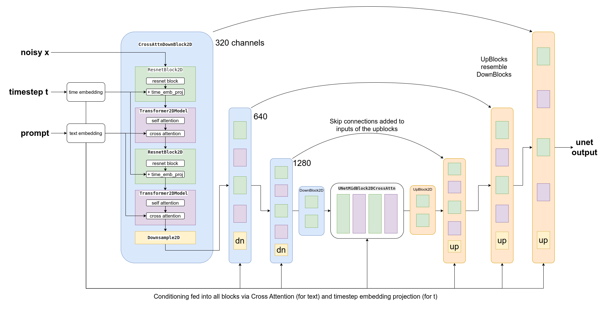

# ユニット3: Stable Diffusion

Hugging Face Diffusion モデルコースのユニット3へようこそ！このユニットでは、Stable Diffusion (SD) と呼ばれる強力な diffusion モデルに出会い、それができることを探ります。

## このユニットを開始する :rocket:

ユニットの手順は以下の通りです:

- 新しい教材がリリースされたときに通知を受けることができるように、[このコースにサインアップ](https://huggingface.us17.list-manage.com/subscribe?u=7f57e683fa28b51bfc493d048&id=ef963b4162)していることを確認してください。
- 以下の資料に目を通し、本ユニットの重要な考え方の概要を理解してください
- [_**Stable Diffusion Introduction**_ notebook](#hands-on-notebook) では、SD を実際に使用するケースをご紹介しています
- Use the _**Dreambooth**_ notebook in the [**hackathon** folder](https://github.com/huggingface/diffusion-models-class/tree/main/hackathon) to fine-tune your own custom Stable Diffusion model and share it with the community for a chance to win some prizes and swag
- (Optional) Check out the [_**Stable Diffusion Deep Dive video**_](https://www.youtube.com/watch?app=desktop&v=0_BBRNYInx8) and the accompanying [_**notebook**_](https://github.com/fastai/diffusion-nbs/blob/master/Stable%20Diffusion%20Deep%20Dive.ipynb) for a deeper exploration of the different components and how they can be adapted for different effects. This material was created for the new FastAI course, ['Stable Diffusion from the Foundations'](https://www.fast.ai/posts/part2-2022.html) - the first few lessons are already available and the rest will be released in the next few months, making this a great supplement to this class for anyone curious about building these kinds of models completely from scratch.

:loudspeaker: [Discord](https://huggingface.co/join/discord) に参加するのを忘れないでください。ここでは、 `#diffusion-models-class` チャンネルで教材について議論したり、作ったものを共有したりすることができます。

## はじめに

 
_Stable Diffusion で生成した画像例_

Stable Diffusion は、強力なテキスト条件付き潜在的拡散モデルです。心配しないでください、この言葉についてはすぐに説明します テキストの記述から素晴らしい画像を作成するその能力は、インターネット上でセンセーションを巻き起こしました。このユニットでは、 SD がどのように機能するかを探り、他にどのようなトリックができるかを見ていくことにします。

## Latent Diffusion

画像のサイズが大きくなると、その画像を処理するために必要な計算能力も大きくなります。特に自己アテンションと呼ばれる操作では顕著で、入力数に対して二次関数的に操作量が増えていきます。128 px の正方形画像は64 px の正方形画像の4倍の画素数を持つため、自己アテンション層では16倍（つまり42）のメモリと計算が必要です。これは、高解像度の画像を生成したい人にとっての問題になります！

 
_Diagram from the [Latent Diffusion paper](http://arxiv.org/abs/2112.10752)_

この問題を軽減するために、 VAE（Variational Auto-Encoder） と呼ばれる別のモデルを用いて、画像をより小さな空間次元に圧縮することができます。十分な学習データがあれば、 VAE は入力画像をより小さく表現することを学習し、この小さな **潜在的** 表現に基づいて画像を忠実に再構成できることが期待されます。 SD で使用されている VAE は、3チャンネルの画像を取り込み、各空間次元の縮小率を8とした4チャンネルの潜像表現を生成します。つまり、512 px の正方形の入力画像は、4 x 64 x 64の潜像に圧縮されることになります。

By applying the diffusion process on these **latent representations** rather than on full-resolution images, we can get many of the benefits that would come from using smaller images (lower memory usage, fewer layers needed in the UNet, faster generation times...) and still decode the result back to a high-resolution image once we're ready to view the final result. This innovation dramatically lowers the cost to train and run these models.

## テキストコンディショニング

In Unit 2 we showed how feeding additional information to the UNet allows us to have some additional control over the types of images generated. We call this conditioning. Given a noisy version of an image, the model is tasked with predicting the denoised version **based on additional clues** such as a class label or, in the case of Stable Diffusion, a text description of the image. At inference time, we can feed in the description of an image we'd like to see and some pure noise as a starting point, and the model does its best to 'denoise' the random input into something that matches the caption. 

 
_Diagram showing the text encoding process which transforms the input prompt into a set of text embeddings (the encoder_hidden_states) which can then be fed in as conditioning to the UNet._

For this to work, we need to create a numeric representation of the text that captures relevant information about what it describes. To do this, SD leverages a pre-trained transformer model based on something called CLIP. CLIP's text encoder was designed to process image captions into a form that could be used to compare images and text, so it is well suited to the task of creating useful representations from image descriptions. An input prompt is first tokenized (based on a large vocabulary where each word or sub-word is assigned a specific token) and then fed through the CLIP text encoder, producing a 768-dimensional (in the case of SD 1.X) or 1024-dimensional (SD 2.X) vector for each token. To keep things consistent prompts are always padded/truncated to be 77 tokens long, and so the final representation which we use as conditioning is a tensor of shape 77x1024 per prompt.

OK, so how do we actually feed this conditioning information into the UNet for it to use as it makes predictions? The answer is something called cross-attention. Scattered throughout the UNet are cross-attention layers. Each spatial location in the UNet can 'attend' to different tokens in the text conditioning, bringing in relevant information from the prompt. The diagram above shows how this text conditioning (as well as timestep-based conditioning) is fed in at different points. As you can see, at every level the UNet has ample opportunity to make use of this conditioning!

## Classifier-free ガイダンス

It turns out that even with all of the effort put into making the text conditioning as useful as possible, the model still tends to default to relying mostly on the noisy input image rather than the prompt when making its predictions. In a way, this makes sense - many captions are only loosely related to their associated images and so the model learns not to rely too heavily on the descriptions! However, this is undesirable when it comes time to generate new images - if the model doesn't follow the prompt then we may get images out that don't relate to our description at all.

 
_Images generated from the prompt "An oil painting of a collie in a top hat" with CFG scale 0, 1, 2 and 10 (left to right)_

To fix this, we use a trick called Classifier-Free Guidance (CGF). During training, text conditioning is sometimes kept blank, forcing the model to learn to denoise images with no text information whatsoever (unconditional generation). Then at inference time, we make two separate predictions: one with the text prompt as conditioning and one without. We can then use the difference between these two predictions to create a final combined prediction that pushes **even further** in the direction indicated by the text-conditioned prediction according to some scaling factor (the guidance scale), hopefully resulting in an image that better matches the prompt. The image above shows the outputs for a prompt at different guidance scales - as you can see, higher values result in images that better match the description.

## その他のコンディショニングの種類: Super-Resolution, Inpainting及びDepth-to-Image

It is possible to create versions of Stable Diffusion that take in additional kinds of conditioning. For example, the [Depth-to-Image model](https://huggingface.co/stabilityai/stable-diffusion-2-depth) has extra input channels that take in-depth information about the image being denoised, and at inference time we can feed in the depth map of a target image (estimated using a separate model) to hopefully generate an image with a similar overall structure.

 
_Depth-conditioned SD is able to generate different images with the same overall structure (example from StabilityAI)_

In a similar manner, we can feed in a low-resolution image as the conditioning and have the model generate the high-resolution version ([as used by the Stable Diffusion Upscaler](https://huggingface.co/stabilityai/stable-diffusion-x4-upscaler)). Finally, we can feed in a mask showing a region of the image to be re-generated as part of the 'in-painting' task, where the non-mask regions need to stay intact while new content is generated for the masked area.

## DreamBooth でのファインチューニング

_Image from the [dreambooth project page](https://dreambooth.github.io/) based on the Imagen model_

DreamBooth is a technique for fine-tuning a text-to-image model to 'teach' it a new concept, such as a specific object or style. The technique was originally developed for Google's Imagen model but was quickly adapted to [work for stable diffusion](https://huggingface.co/docs/diffusers/training/dreambooth). Results can be extremely impressive (if you've seen anyone with an AI profile picture on social media recently the odds are high it came from a dreambooth-based service) but the technique is also sensitive to the settings used, so check out our notebook and [this great investigation into the different training parameters](https://huggingface.co/blog/dreambooth) for some tips on getting it working as well as possible.

## ハンズオンノートブック

| 章                                     | Colab                                                                                                                                                                                               | Kaggle                                                                                                                                                                                                   | Gradient                                                                                                                                                                               | Studio Lab                                                                                                                                                                                                   |
|:--------------------------------------------|:----------------------------------------------------------------------------------------------------------------------------------------------------------------------------------------------------|:---------------------------------------------------------------------------------------------------------------------------------------------------------------------------------------------------------|:---------------------------------------------------------------------------------------------------------------------------------------------------------------------------------------|:-------------------------------------------------------------------------------------------------------------------------------------------------------------------------------------------------------------|
| Stable Diffusion Introduction                                |               |               |               |               |
| DreamBooth Hackathon Notebook                      |               |               |               |               |
| Stable Diffusion Deep Dive                               |               |               |               |               |

この時点で、付属のノートブックを使い始めるのに十分な知識があります。上のリンクから好きなプラットフォームで開いてください。 Dreambooth はかなりの計算能力を必要とするので、 Kaggle や Google Colab を使う場合はランタイムタイプを 'GPU' に設定しておくとよいでしょう。

'Stable Diffusion Introduction' ノートブックは、 🤗 Diffusers ライブラリを使った stable diffusion の簡単な紹介で、パイプラインを使って画像を生成・修正する基本的な使用例について説明しています。

DreamBooth Hackathon Notebook （[ハッカソンフォルダ](https://github.com/huggingface/diffusion-models-class/tree/main/hackathon)内）には、新しいスタイルやコンセプトをカバーするモデルのカスタムバージョンを作成するために、自分の画像で SD をファインチューニングする方法が紹介されています。

最後に、 'Stable Diffusion Deep Dive' ノートブックとビデオでは、典型的な生成パイプラインの各ステップを分解し、各ステージを変更してさらに創造的な制御を行うための斬新な方法を提案します。

## プロジェクトタイム

**DreamBooth** ノートブックの指示に従って、指定されたカテゴリの1つについて独自のモデルをトレーニングしてください。各カテゴリで最も優れたモデルを選ぶために、必ず出力例を添付してください。賞品やGPUクレジットなどの詳細については、[ハッカソン情報](https://github.com/huggingface/diffusion-models-class/tree/main/hackathon)をご覧ください。

## 追加資料

- [High-Resolution Image Synthesis with Latent Diffusion Models](http://arxiv.org/abs/2112.10752) - Stable Diffusion の背後にあるアプローチを紹介した論文

- [CLIP](https://openai.com/blog/clip/) - CLIP はテキストと画像の接続を学習し、 CLIP テキストエンコーダーはテキストプロンプトをSDで使用される豊富な数値表現に変換するために使用される。最近のオープンソースの CLIP の亜種（そのうちの1つが SD バージョン2に使われている）の背景については、 [OpenCLIP に関するこの記事](https://wandb.ai/johnowhitaker/openclip-benchmarking/reports/Exploring-OpenCLIP--VmlldzoyOTIzNzIz)も参照してください。

- [GLIDE: Towards Photorealistic Image Generation and Editing with Text-Guided Diffusion Models](https://arxiv.org/abs/2112.10741) テキストコンディショニングと CFG を実証した初期の論文

もっと素晴らしいリソースがありますか？このリストに追加します。
